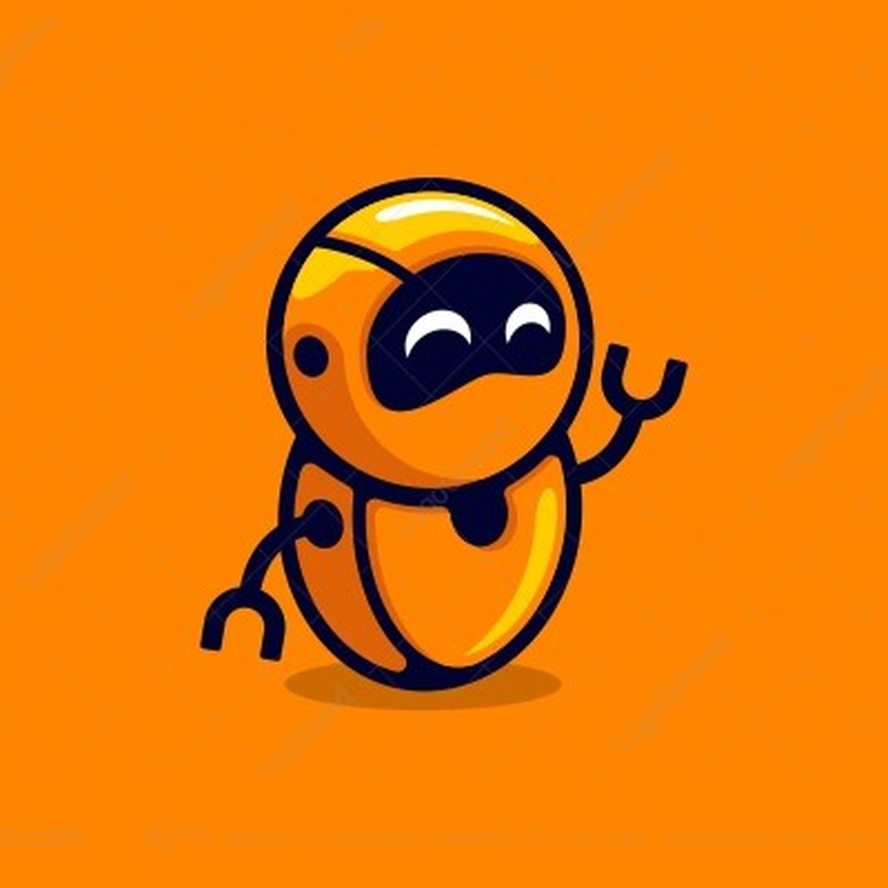

<!-- Improved compatibility of back to top link: See: https://github.com/othneildrew/Best-README-Template/pull/73 -->

<!--
*** Thanks for checking out the Best-README-Template. If you have a suggestion
*** that would make this better, please fork the repo and create a pull request
*** or simply open an issue with the tag "enhancement".
*** Don't forget to give the project a star!
*** Thanks again! Now go create something AMAZING! :D
-->

<!-- PROJECT LOGO -->
 

  

  <h3 align="center">StudyBot</h3>

  

    A Discord bot to amplify virtual group studying environments
     
  

<!-- TABLE OF CONTENTS -->

  
Table of Contents

  <ol>
    <li>
      <a href="#about-the-project">About The Project</a>
      <ul>
        <li><a href="#built-with">Built With</a></li>
      </ul>
    </li>
    <li><a href="#contact">Contact</a></li>
  </ol>

<!-- ABOUT THE PROJECT -->
## About The Project

[![StudyBot][product-screenshot]](https://example.com)

This project is a Discord bot designed for students to be able to thrive studying collaboratively within a virtual environment such as Discord. The motivation behind the creation of this project was the lifestyle switch which the pandemic brought forth for students like myself, and being able to provide a means of continuing social studying environments online.

Features Include:
* Questionbank capabilities to test yourself and others to study for upcoming examinations
* Dictionary commands to get definitions of words
* Wiki commands to get summarized content regarding a topic
* Translation commands to integrate studying, sharing, and learning other languages

### Built With

This section should list any major frameworks/libraries used to bootstrap your project. Leave any add-ons/plugins for the acknowledgements section. Here are a few examples.

* [![Python][py]][python-url]
* [![SQL][sq]][sql-url]
* [![Discord][disc]][disc]

<!-- CONTACT -->
## Contact

* Ayaan Dada - ayaan0145@gmail.com
* Mizna Dada - miznadada@gmail.com

Project Link: https://github.com/ayaan-d/StudyBot

(<a href="#readme-top">back to top</a>)

<!-- MARKDOWN LINKS & IMAGES -->
<!-- https://www.markdownguide.org/basic-syntax/#reference-style-links -->
[python-url]: https://img.shields.io/badge/Python-3776AB?style=for-the-badge&logo=python&logoColor=white
[sql-url]: https://img.shields.io/badge/MySQL-00000F?style=for-the-badge&logo=mysql&logoColor=white
[py]: https://img.shields.io/badge/Python-3776AB?style=for-the-badge&logo=python&logoColor=white
[sq]: https://img.shields.io/badge/MySQL-00000F?style=for-the-badge&logo=mysql&logoColor=white
[disc]: https://img.shields.io/badge/Discord-7289DA?style=for-the-badge&logo=discord&logoColor=white
[product-screenshot]: studybot.png
